# 🍪 Recipes App

## 🛠 Used Tech
- Swift
- UIKit
- SnapKit
- CoreData
- Kingfisher
- Firebase Auth
- Firebase Storage
- Firebase Firestore
- Dependency injection (Swinject)
- VIPER Architecture

## Home

    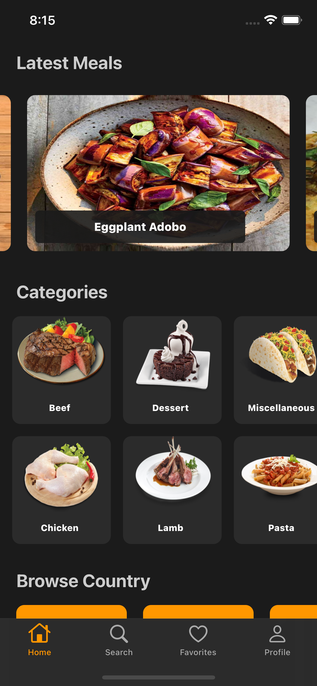
    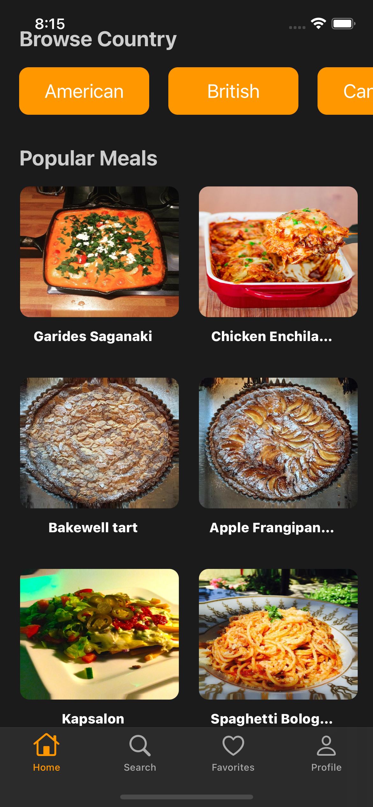
    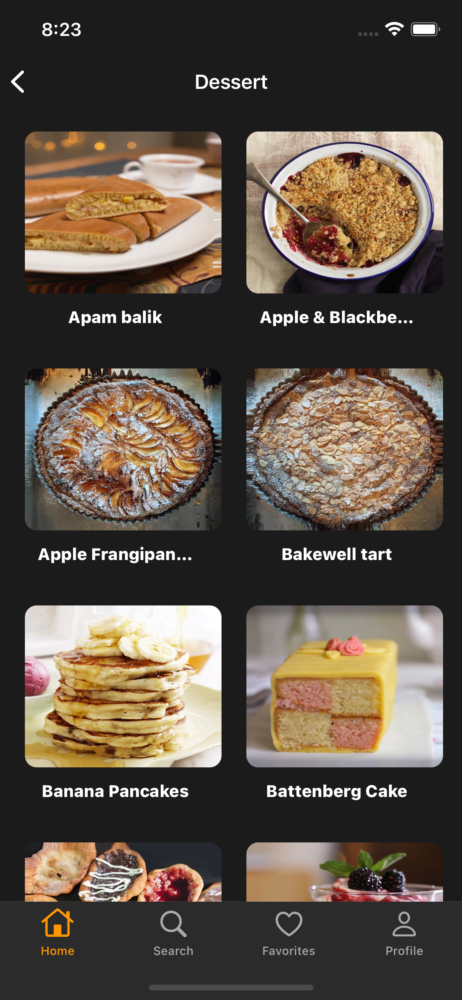

## Details

    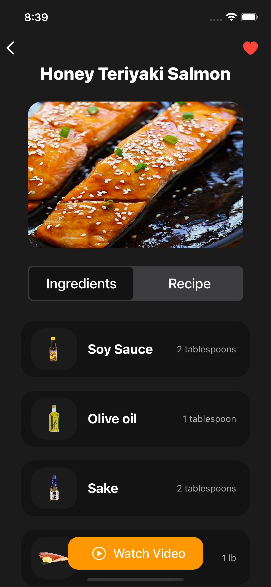
    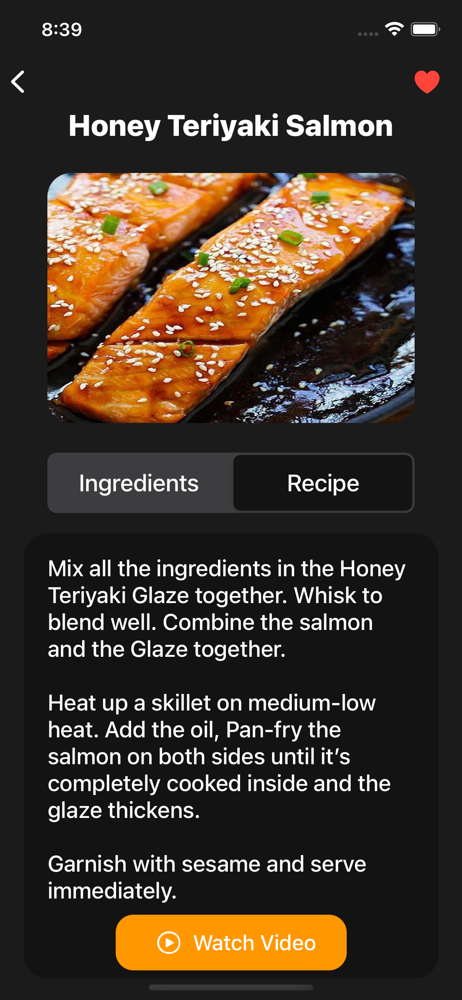
    

## Search

    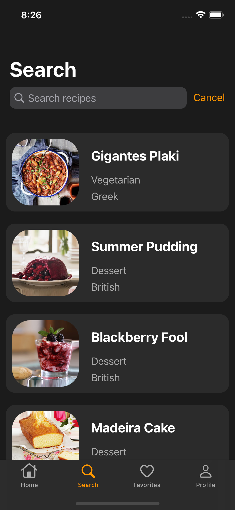
    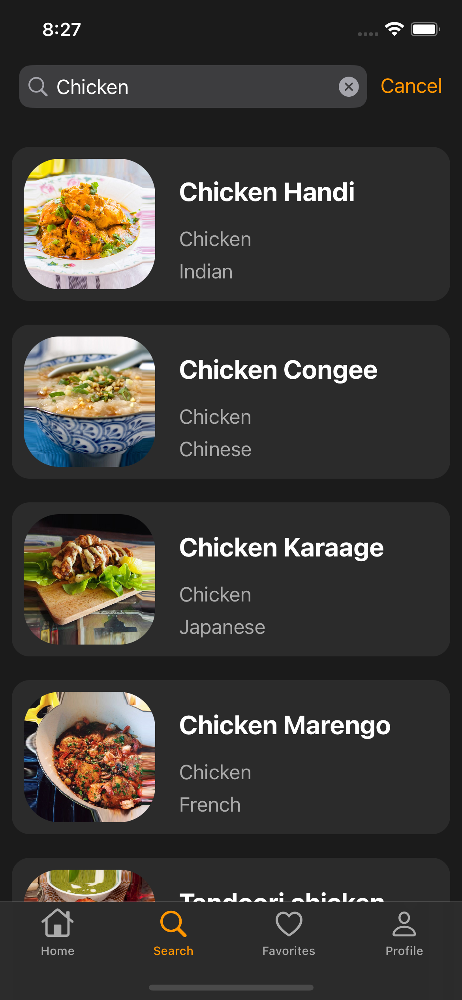
    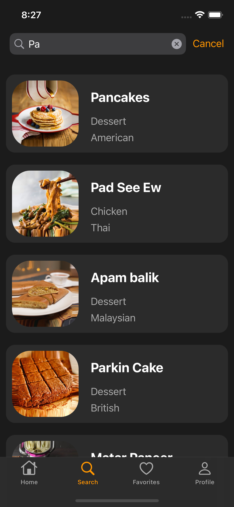

## Favorites

    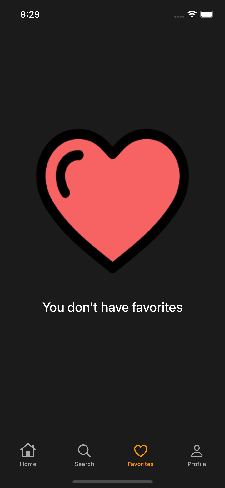
    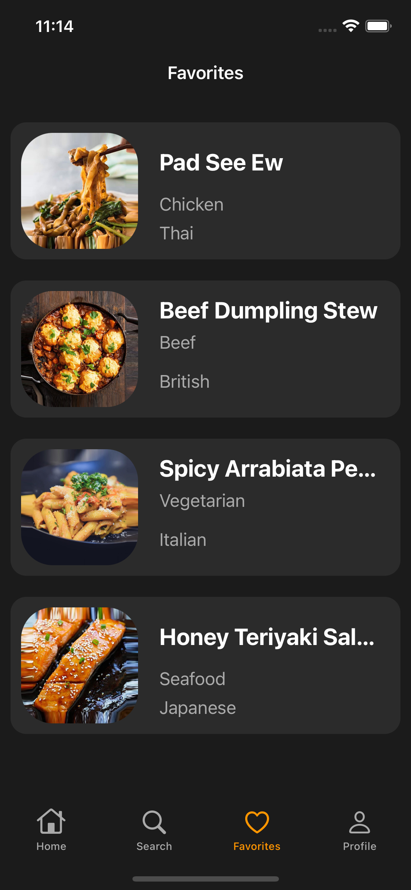
    

## Login

    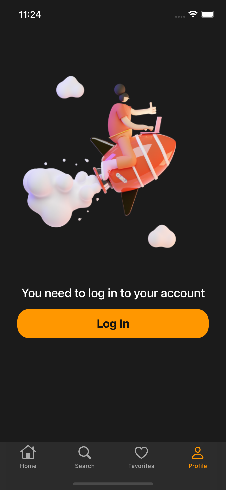
    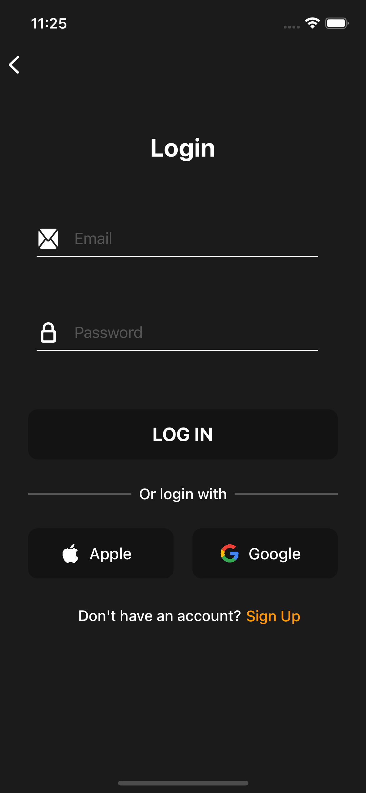
    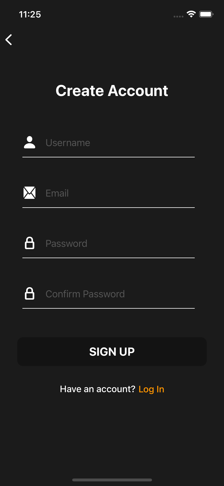

## Profile

    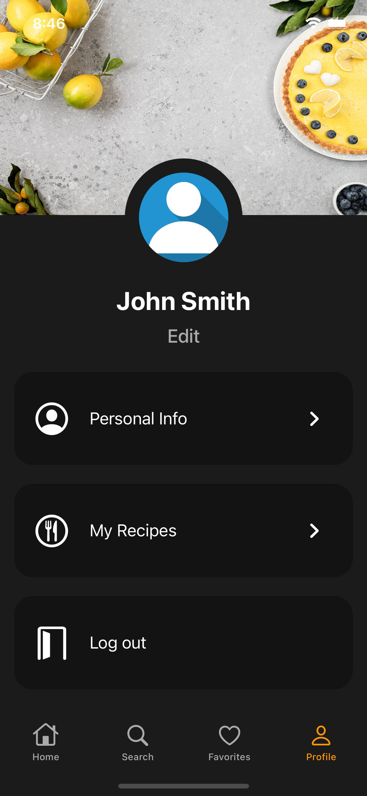
    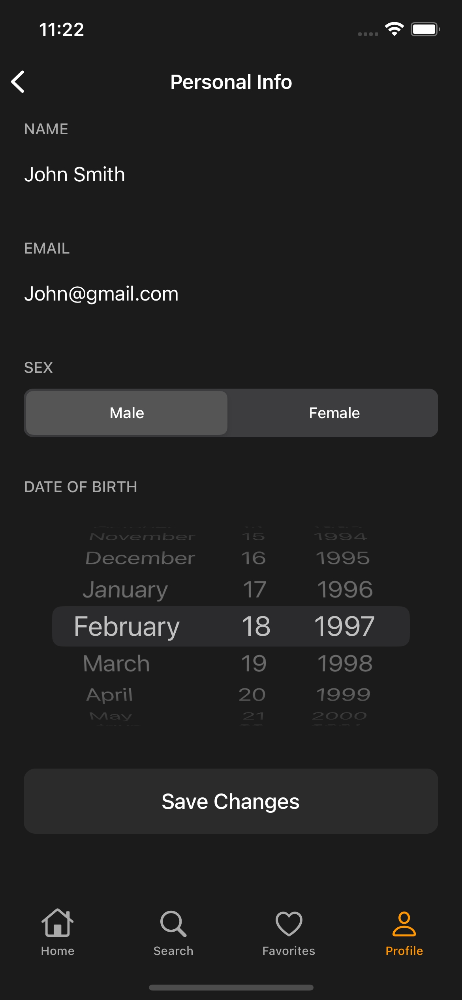
    

